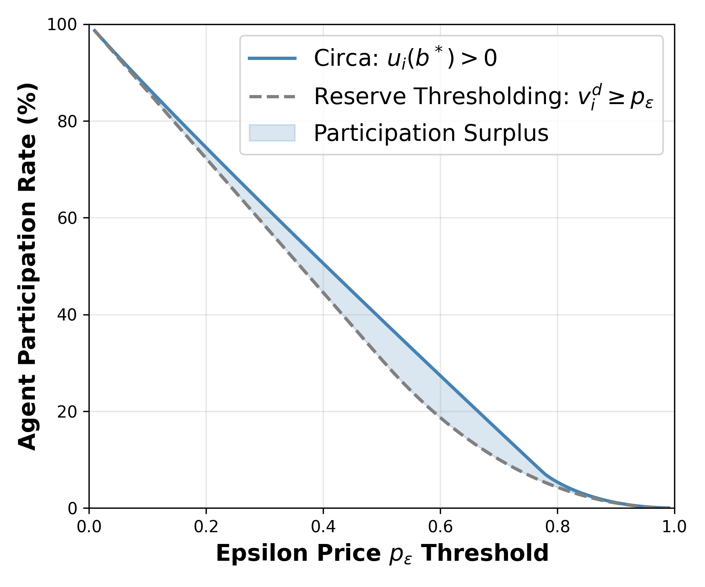
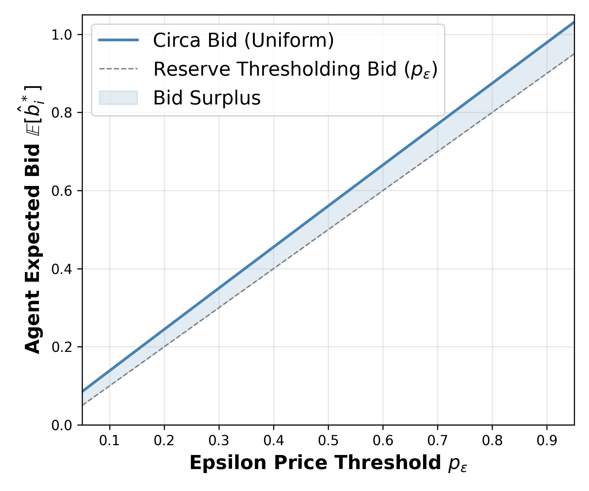

# Advancing Regulation in Artificial Intelligence: An Auction-Based Approach

[](https://doi.org/10.1145/3805689.3812397)
[](https://arxiv.org/abs/2410.01871)
[](LICENSE)

**Marco Bornstein, Zora Che, Suhas Julapalli, Abdirisak Mohamed, Amrit Singh Bedi, Furong Huang**
*ACM Conference on Fairness, Accountability, and Transparency (FAccT '26)*

This is the official code for **Circa**, the *Compliance-Incentivized Regulatory-Centered Auction*.

## Overview

Minimum-standard AI regulation gives developers no reason to do more than the minimum, and it
can push developers out of the regulatory process entirely. We model AI regulation as an
all-pay auction. A regulator sets a compliance threshold $\epsilon$, where reaching it costs
$p_\epsilon$. Developers submit models along with the compliance they paid for. The regulator
rejects models below the threshold, pairs the remaining agents at random, and gives the more
compliant model of each pair a premium reward on top of deployment.

In the Nash equilibrium (Theorem 5), each agent bids above the threshold:

```math
\hat b_i^* \;=\; p_\epsilon \;+\; v_i^p\,F(v_i^p) \;-\; \int_0^{v_i^p} F(z)\,dz \;>\; p_\epsilon
```

Here $v_i^p$ is the agent's value for the premium reward and $F$ is its distribution across
participating agents. Compared with Reserve Thresholding, a minimum-standard baseline, Circa
raises compliance by about 20% and participation by about 15%.

| Participation (Figure 3) | Compliance (Figure 4) |
| :---: | :---: |
|  |  |

## Repository structure

```
circa/          Core library: closed-form value/premium distributions and equilibrium quantities
experiments/    One script per paper figure (writes PNGs to figures/)
fairness/       Compliance-cost case study: VGG-16 on FairFace (Figure 5, Table 2)
figures/        Figures generated by the scripts
tests/          Checks against the paper's corollaries, numerical integration, and simulation
```

## Installation

```bash
git clone https://github.com/marcobornstein/AI-Regulatory-Auctions.git
cd AI-Regulatory-Auctions
pip install -e ".[test]"
```

This needs Python 3.10 or newer. The theory experiments use only NumPy, SciPy, and Matplotlib.
On a laptop CPU, each figure takes a few seconds; the slowest,
`equilibrium.py --dist beta --p-eps 0.75`, takes about 7 s. For the fairness case study, see
[fairness/README.md](fairness/README.md).

## Reproducing the paper

Figure numbers follow [arXiv v3](https://arxiv.org/abs/2410.01871). Every script is seeded
(`--seed`, default 0) and takes `--dist {uniform,beta}` to choose the value distribution,
either $V_i \sim U(0,1)$ or $V_i \sim \mathrm{Beta}(2,2)$.

| Result | Command | Output |
| --- | --- | --- |
| Figure 2: Nash equilibrium validation | `python experiments/equilibrium.py --dist uniform --p-eps 0.75` | `figures/equilibrium_uniform_pe0.75.png` |
| Figure 3: participation rate | `python experiments/participation.py --dist uniform` | `figures/participation_uniform.png` |
| Figure 4: compliance (expected bid) | `python experiments/expected_bid.py --dist uniform` | `figures/expected_bid_uniform.png` |
| Appendix: premium PDF/CDF | `python experiments/premium_distribution.py --dist uniform --p-eps 0.25` | `figures/premium_{pdf,cdf}_uniform_pe0.25.png` |
| Figure 5 and Table 2: fairness cost | see [fairness/README.md](fairness/README.md) | `figures/fairness_ablation.png` |

To regenerate every theory figure:

```bash
for dist in uniform beta; do
  for p in 0.25 0.5 0.75; do python experiments/equilibrium.py --dist $dist --p-eps $p; done
  for p in 0.25 0.5; do python experiments/premium_distribution.py --dist $dist --p-eps $p; done
  python experiments/participation.py --dist $dist
  python experiments/expected_bid.py --dist $dist
done
```

## Using the library

```python
import numpy as np
from circa import DISTRIBUTIONS, expected_bid, optimal_bid, participation_rates

uniform = DISTRIBUTIONS["uniform"]
optimal_bid(np.array([0.1, 0.3]), p_eps=0.5, dist=uniform)  # Nash bids for two premium values
expected_bid(0.5, uniform)                                  # E[b*] over participating agents (Proposition 1)
participation_rates(0.5, uniform)                           # (Circa, Reserve Thresholding) participation
```

The model has these ingredients. Agent $i$ has total value $V_i$, split into a premium value
$v_i^p = \lambda_i V_i$ and a deployment value $v_i^d = (1-\lambda_i)V_i$, with
$\lambda_i \sim U(0, 1/2)$. Agents with $V_i \lt p_\epsilon$ cannot afford to comply, so $F$ is the
premium distribution over agents with $V_i \ge p_\epsilon$. To study another value distribution,
subclass `circa.distributions.ValueDistribution` and supply its closed-form `pdf`, `cdf`, and
`cdf_integral`. Run `pytest` to check a new subclass against numerical integration and simulation.

## Tests

```bash
pytest
```

The tests check that the closed-form PDF, CDF, and integrated CDF agree with each other and with
simulation, and that the bids match Corollaries 1 and 2. They also check that the expected bid and
participation rates match Monte Carlo estimates, and that $b^*$ is a best response. The fairness
test confirms that the table in `fairness/README.md` matches the saved training results.

## Citation

```bibtex
@inproceedings{bornstein2026advancing,
  title     = {Advancing Regulation in Artificial Intelligence: An Auction-Based Approach},
  author    = {Bornstein, Marco and Che, Zora and Julapalli, Suhas and Mohamed, Abdirisak and Bedi, Amrit Singh and Huang, Furong},
  booktitle = {Proceedings of the 2026 ACM Conference on Fairness, Accountability, and Transparency},
  series    = {FAccT '26},
  year      = {2026},
  pages     = {467--496},
  publisher = {Association for Computing Machinery},
  doi       = {10.1145/3805689.3812397},
  url       = {https://doi.org/10.1145/3805689.3812397}
}
```

## License

The code is released under the [MIT License](LICENSE). The fairness case study uses the
[FairFace](https://github.com/joojs/fairface) dataset (CC BY 4.0), and its training loop is
adapted from [transfer-fairness](https://github.com/umd-huang-lab/transfer-fairness).
